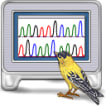

Hello! My work bridges molecular microbiology and computational biology.

Intersted w. phageGenEngeneering. Experianced in microdiagnostics. Integrated BLASTsearch to CoreWiki. 
> **RNAseq analysis workflows coming soon 🚀**

## **𝗖𝗼𝗺𝗽𝘂𝘁𝗮𝘁𝗶𝗼𝗻𝗮𝗹 𝗕𝗶𝗼𝗹𝗼𝗴𝘆**

### Tech Stack

| Application Area               | Program |
|--------------------|---------|
| Sequence Analyses  |   |
| Metagenomics       |  |
| Phylogenetics      |    |

| Category               | Tool |
|--------------------|---------|
| Programming languages       |     |
| Databases          |   |
| Frameworks         |  |

## **𝗠𝗼𝗹𝗲𝗰𝘂𝗹𝗮𝗿 𝗠𝗶𝗰𝗿𝗼𝗯𝗶𝗼𝗹𝗼𝗴𝘆**
  - PCR (conventional, real-time, and digital)
  - 16S rDNA sequencing
  - ERIC clone identification
   

  mecA</i>, <i>nuc</i> genes  27.05.2025" width="150"/> 
  Electrophoresis of conventional multyplex PCR for <i>Staphylococcus aureus</i> with 16S rDNA region and <i>mecA</i>, <i>nuc</i> genes  27.05.2025

